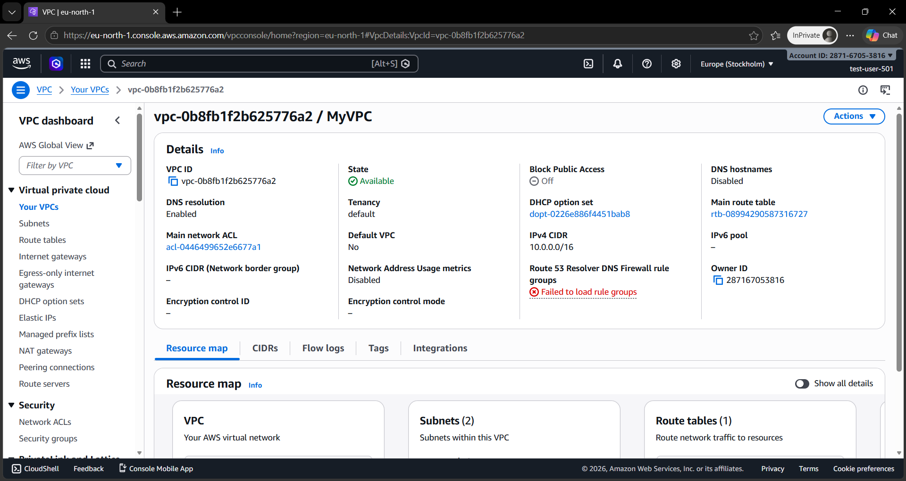
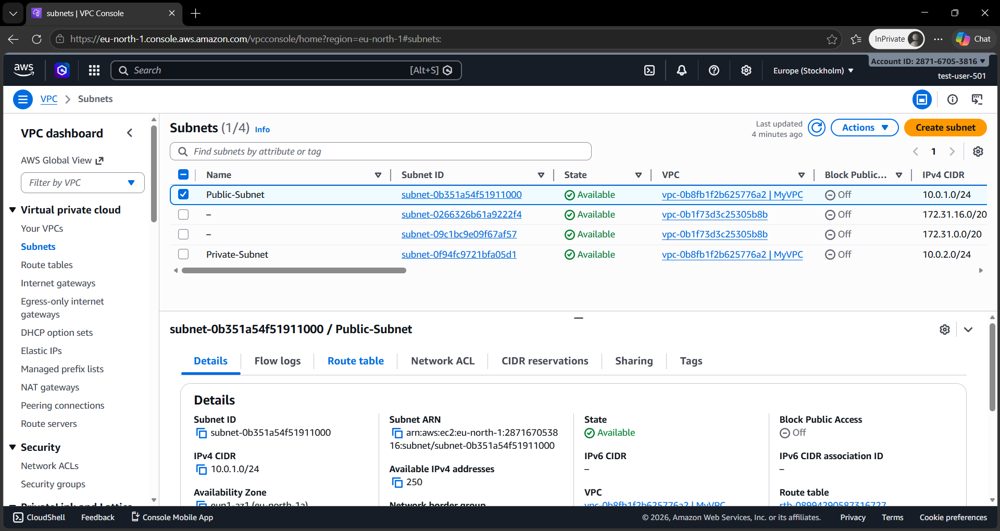
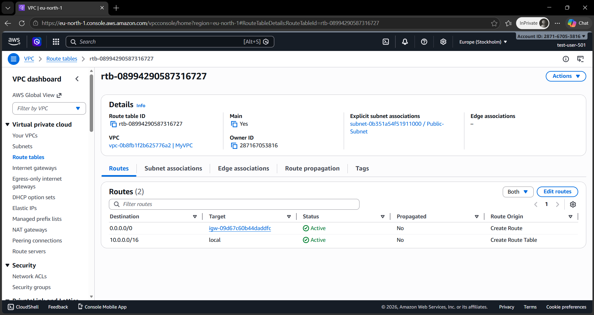
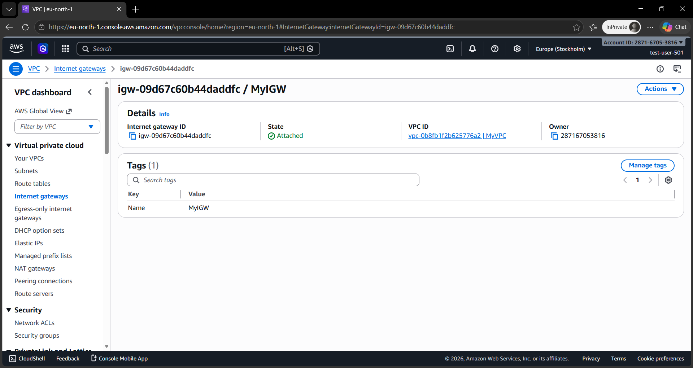
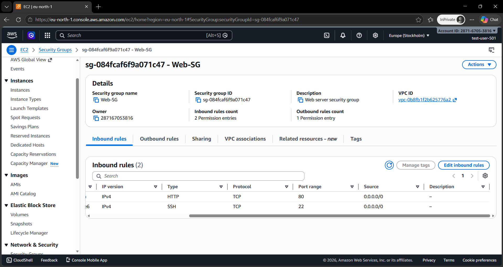
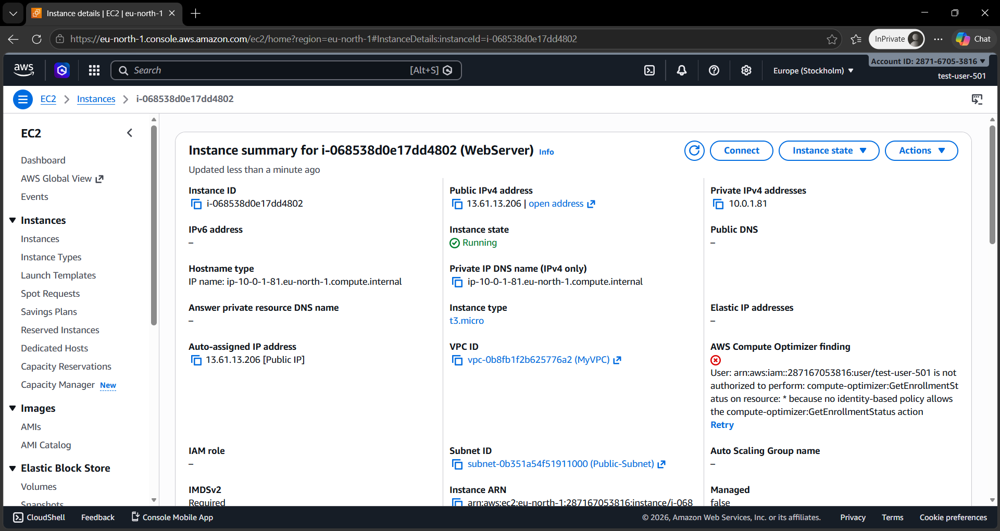
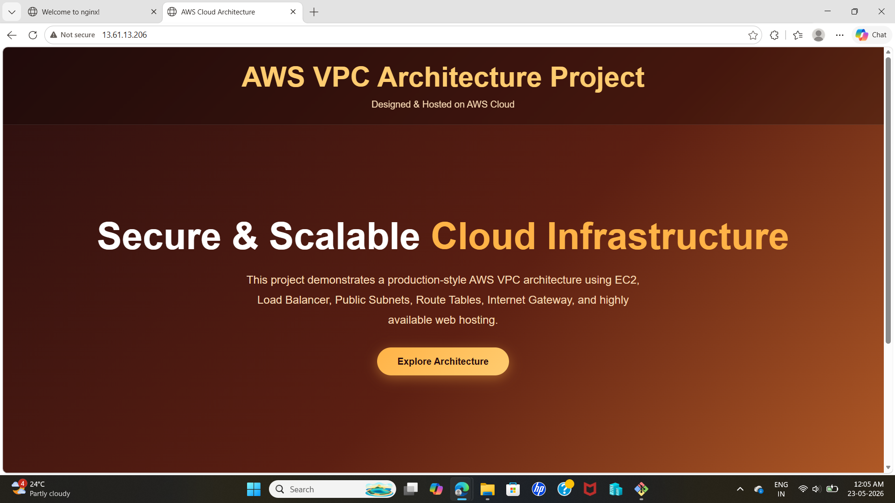

# AWS VPC Architecture Project

## Project Overview

This project demonstrates the deployment of a static website inside a custom AWS Virtual Private Cloud (VPC) using AWS Free Tier services. The architecture was designed to provide secure networking, internet connectivity, and website hosting using core AWS infrastructure components.

The project includes:
- Custom VPC creation
- Public and Private Subnets
- Internet Gateway configuration
- Route Table setup
- Security Group configuration
- EC2 instance deployment
- NGINX web server setup
- Static website hosting

---

# AWS Services Used

- Amazon VPC
- Amazon EC2
- Internet Gateway
- Route Tables
- Security Groups
- NGINX
- Ubuntu Server 22.04

---

# Architecture Diagram

```text
Internet
   │
   ▼
Internet Gateway
   │
   ▼
Public Route Table
   │
   ▼
Public Subnet (10.0.1.0/24)
   │
   ▼
EC2 Instance + NGINX
   │
   ▼
Hosted Website
```

---

# Network Configuration

| Component | Configuration |
|---|---|
| VPC CIDR | 10.0.0.0/16 |
| Public Subnet | 10.0.1.0/24 |
| Private Subnet | 10.0.2.0/24 |
| Route Table | 0.0.0.0/0 → Internet Gateway |
| Security Group | SSH + HTTP |

---

# Security Group Rules

| Type | Port | Source |
|---|---|---|
| SSH | 22 | My IP |
| HTTP | 80 | 0.0.0.0/0 |

---

# Deployment Steps

## 1. Created Custom VPC
- Configured custom IPv4 CIDR block
- Created isolated AWS network

## 2. Created Public and Private Subnets
- Public subnet for internet-facing resources
- Private subnet for secure internal architecture

## 3. Configured Internet Gateway
- Attached Internet Gateway to VPC
- Enabled internet access for public subnet

## 4. Configured Route Table
- Added route:
  0.0.0.0/0 → Internet Gateway

## 5. Configured Security Group
- Allowed SSH access on port 22
- Allowed HTTP access on port 80

## 6. Launched EC2 Instance
- Ubuntu 22.04 LTS
- t2.micro instance
- Public subnet deployment

## 7. Installed NGINX

```bash
sudo apt update -y
sudo apt install nginx -y
```

## 8. Hosted Static Website
- Uploaded custom `index.html`
- Deployed website using NGINX

---

# Project Screenshots

# Project Screenshots

## VPC Overview


---

## Subnets


---

## Route Table


---

## Internet Gateway


---

## Security Group


---

## EC2 Instance


---

## Website Output


---

## EC2 Instance


---

## Website Output


---

# Learning Outcomes

Through this project, I learned:
- AWS networking fundamentals
- VPC architecture design
- Public vs Private subnet concepts
- Internet routing configuration
- EC2 deployment and SSH connectivity
- Security Group management
- Linux server configuration
- Website hosting using NGINX

---

# Future Improvements

- Add Load Balancer
- Configure Auto Scaling Group
- Deploy highly available multi-AZ architecture
- Use Route 53 custom domain
- Add HTTPS using SSL/TLS

---

# Author

Misha Mohammadi
